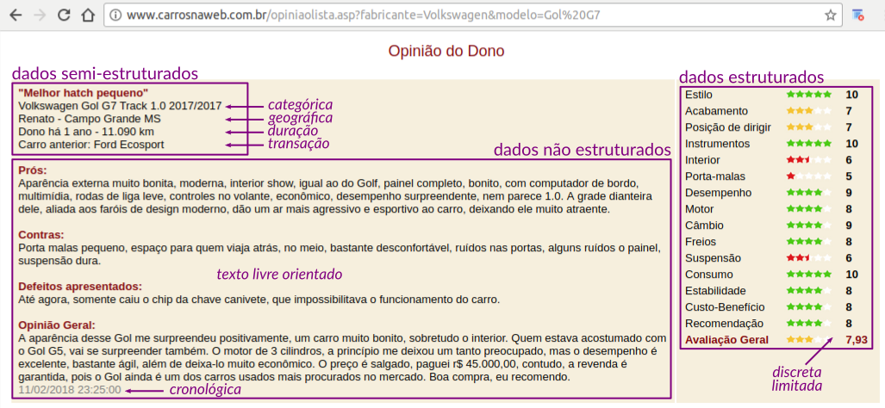

Descrição dos conjuntos de dados
================================

*Quais os dados selecionados para o Hackathon?*

Os dados selecionais para o Hackathon de Data Science foram de avaliação
de clientes de veículos disponíveis no <http://www.carrosnaweb.com.br/>,
guia de opinião do dono.  Os dados foram extraídos com recursos de web
scraping da linguagem R.

*Por que esses dados foram escolhidos?*

Esses dados foram escolhidos por uma série de características
relevantes para o desafio:

  1. São dados abundantes, ou seja, são centenas de avaliações para os
     modelos de veículos escolhidos.  Em geral, padrões, tendências e
     associações são detectados mais facilmente em dados maiores.  Por
     outro lado, o tamanho também tráz restrições de natureza
     operacional.
  2. São dados com muita variedade pois misturam dados estruturados,
     semi-estruturados e não estruturados.  No conjunto, variáveis de
     quase todos os tipos estão presentes: numéricas (notas),
     categóricas (espeficicação do veículo), geográficos
     (cidade/estado), cronológicos (ano/data de avalição) e texto livre.
  3. Os dados são de contexto público e cotidiano, ou seja, são
     facilmente compreendidos diferentemente de dados de contexto
     específico como dados clínicos, econômicos, agronômicos ou
     metereológicos, por exemplo.
  4. Os dados necessiatam de curadoria, principalmente a porção
     correspondente aos dados semi-estruturados e não estruturados.  Por
     exemplo, em ambos, o uso de expressões regulares e formatação de
     datas será importante para a construção ou padronização de
     variáveis.  Em data science, sabe-se que a maior parte do tempo
     está na preparação dos dados e que o sucesso das fases subsequentes
     depende do êxito na preparação e compreensão dos dados.

A figura a seguir destaca a organização dos dados.

*Por que foram escolhidos estes veículos?*

Foram escolhidos os veículos mais populares porque possuem a maior
quantidade de avaliações.  Os veículos são de mesma categoria
automotiva, o que permite conduzir comparações entre veículos de
fabricantes diferentes ou mesmo entre versões diferentes do mesmo
veículo.

*Qual o formado em que os dados foram disponibilizados?*

Os dados estruturados (notas para os quesitos) estão em arquivo CSV com
campos delimitados por `;` ([`notas.csv`](notas.csv)).  As notas de um
mesmo avaliador estão dispostas verticalmente, um quesito após o outro,
ocupando assim 15 linhas no total.  A ID formada por 8 dígitos
hexadecimais identifica unicamente cada avaliação.

Os dados da porção semi/não estruturada estão em JSON
([`opinioes.json`](opinioes.json)).  Cada avaliação é um array JSON de
10 elementos (supostamente, pois podem haver discrepâncias acidentais).
O primeiro elemento de cada array é a ID que permite pareamento dos
dados das duas porções.  Os demais elementos do array contém a
informação de fabricante, modelo, especificações, ano, dono, cidade,
distância percorrida, texto do campo pró, contra, defeitos, data da
avaliação, etc.

*Que tipo de análises podem ser feitas com os dados?*

A resposta para esse pergunta não é curta.  Mas se for para dar uma
resposta curta: todos os tipos de análises podem ser feitas.  No
entanto, devem ser preconizadas análises que extraiam informação útil
não trivial dos dados e que façam sentido.  Seguem algumas orientações.

  1. Relacionar a distribuição espacial (cidade/estado) com índices de
     satisfação.
  2. Compreender a partir de um número reduzido de variáveis as
     dimensões da satisfação.
  3. Explorar a relação entre as variáveis numéricas (notas) buscando
     compreender qual é mais influente no índice de satisfação ou qual
     explica mais a diferença entre dois veículos.
  4. Descobrir como utilizar a informação no texto para predizer o
     índice de satisfação.
  5. Automatizar a extração/processamento/resumo da informação sobre os
     defeitos apresentados.
  6. Determinar o efeito do carro anterior no nível de satisfação.
  7. Verificar a relação entre a satisfação e a distância percorrida ou
     tempo de posse do veículo.
